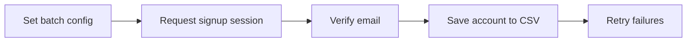

# discord-account-manager

*A desktop-first Discord account generator for testers, bot developers, and community managers who need disposable accounts without repeating the same manual signup flow.*

## What this is

**discord-account-manager** is a Windows desktop tool that automates the repetitive parts of creating Discord accounts for testing, staging servers, and bot development environments. Instead of manually filling out the signup form, solving captchas by hand, and verifying emails one at a time, you point the tool at a batch size and it produces ready-to-use accounts with the credentials logged locally on your machine.

The project started from a simple problem: teams running Discord bots, moderation tools, or integration tests needed a repeatable way to spin up throwaway accounts without touching production data. discord-account-manager keeps that scope narrow — it is not a growth tool, not a spam tool, and not designed to interact with real communities. It exists to make local development and QA faster.

  

The button opens the project's landing page, where the current build is available to download.

## Who it is for

- **Bot developers** who need multiple test accounts to simulate multi-user interactions in a Discord server.
- **QA engineers** validating moderation bots, welcome flows, or permission systems before shipping.
- **Server administrators** setting up staging or sandbox servers that mirror production without using real member data.
- **Students and hobbyists** learning how Discord's account and API systems behave in a controlled, low-stakes environment.
- **Automation researchers** studying account provisioning workflows for internal tooling.

## What you can do

- **Generate accounts in batches** with a configurable count per run.
- **Assign usernames and passwords** using patterns you define, or let the tool randomize them.
- **Handle email verification** through built-in support for disposable inbox providers.
- **Export account lists** to a local CSV file for use in your own scripts or test suites.
- **Run headless or windowed** depending on whether you want to watch the process or let it run in the background.
- **Throttle request timing** to keep batch runs stable instead of firing requests as fast as possible.
- **Retry failed signups automatically** without restarting the whole batch.
- **Keep everything local** — no accounts or credentials are sent to any external server.

## Getting started

1. Open the landing page linked above.
2. Download the latest Windows build (a single `.exe`, no installer required).
3. Run the executable — Windows may show a SmartScreen prompt for unsigned apps; choose "Run anyway."
4. Set your batch size and options in the app window.
5. Start the run and check the exported CSV once it finishes.

## Requirements

| OS | RAM | Disk |
|---|---|---|
| Windows 10 (64-bit) or Windows 11 | 4 GB minimum, 8 GB recommended | 200 MB free space |

No Python, Node, or build toolchain is needed — the app is a standalone executable that runs as-is.

## How it works

1. You set a batch size and naming pattern in the app.
2. The tool requests a new signup session for each account in the batch.
3. It fills in the required fields and resolves email verification through a connected inbox.
4. Each completed account is written to a local results file as it finishes.
5. Failed attempts are queued for a retry pass before the run closes.

## FAQ

**Is a Discord account generator against Discord's Terms of Service?**
Creating accounts outside Discord's normal signup flow can conflict with their Terms of Service. This tool is built for local testing and development environments, not for use on live community servers, and you're responsible for how you use generated accounts.

**Why do I need email verification support?**
Discord requires a verified email for most account actions. The tool connects to disposable inbox providers to automate that step instead of requiring you to check email manually for every account.

**Can I run this on macOS or Linux?**
Not currently. The build targets Windows 10/11 only. Cross-platform support is tracked on the roadmap below.

**Will my generated accounts get banned?**
Discord actively detects unusual signup patterns. Accounts made this way are best treated as disposable and used only in non-production, low-risk contexts like local bot testing.

**Does this tool store my data anywhere online?**
No. Generated credentials are written to a local CSV on your machine only; nothing is transmitted to an external server.

## Troubleshooting

- **Windows SmartScreen blocks the app** — click "More info" then "Run anyway." The binary is unsigned, which is normal for small open-source tools.
- **Email verification keeps failing** — some inbox providers get temporarily rate-limited; switch providers in settings or slow down your batch interval.
- **Batch runs stop midway** — check your internet connection first, then reduce batch size and increase the delay between signups.
- **CSV export is empty** — confirm the app has write permission to its folder; running from a restricted directory (like Program Files) can block file writes.

## Community & roadmap

Issues and pull requests are welcome — small fixes, documentation improvements, and provider integrations are all good first contributions. Open a discussion thread if you want to propose a feature before building it; that keeps effort from being duplicated.

Planned next: macOS support, a proxy-rotation option for batch runs, and a lightweight scheduling mode for recurring test setups. Priorities shift based on what the community actually asks for in Discussions, so feel free to weigh in.

## License

Released under the [MIT License](LICENSE). This project is provided as-is, without warranty, for educational and testing purposes. You are responsible for complying with Discord's Terms of Service and applicable laws in your use of this tool.

  

